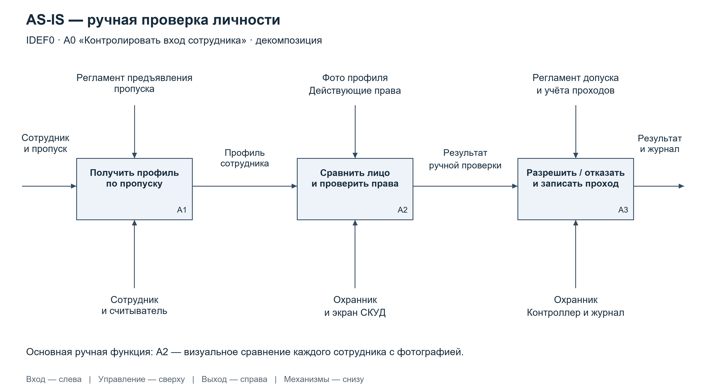
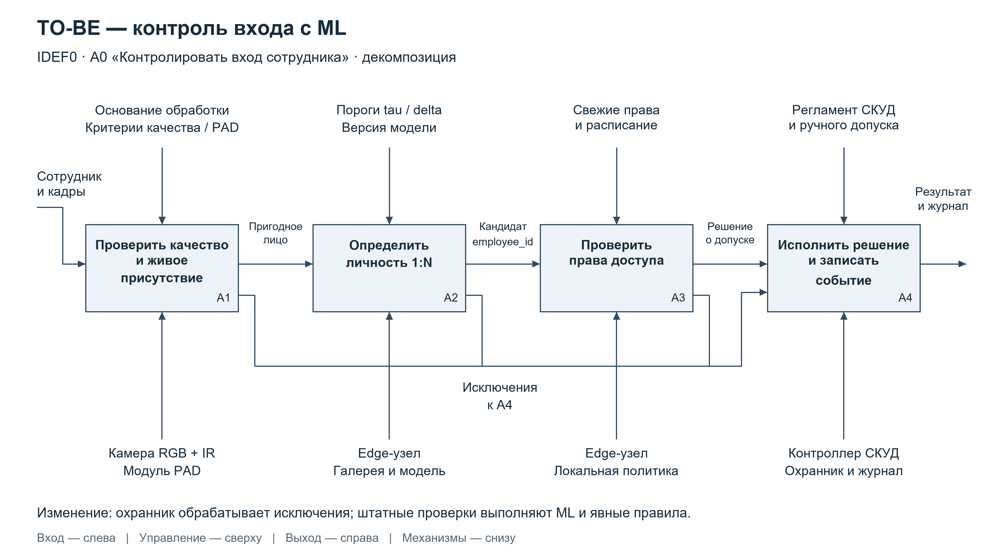
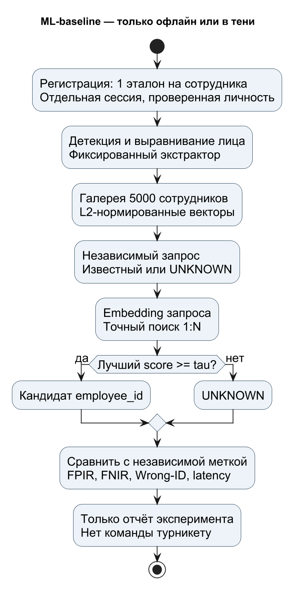
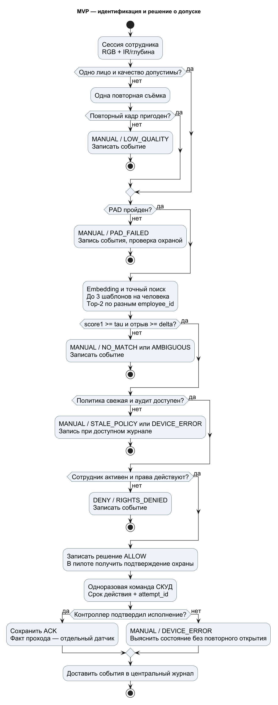
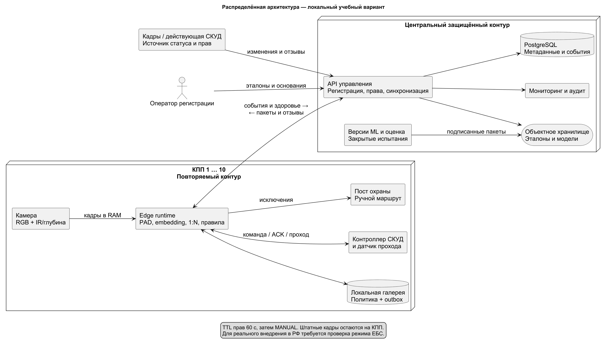
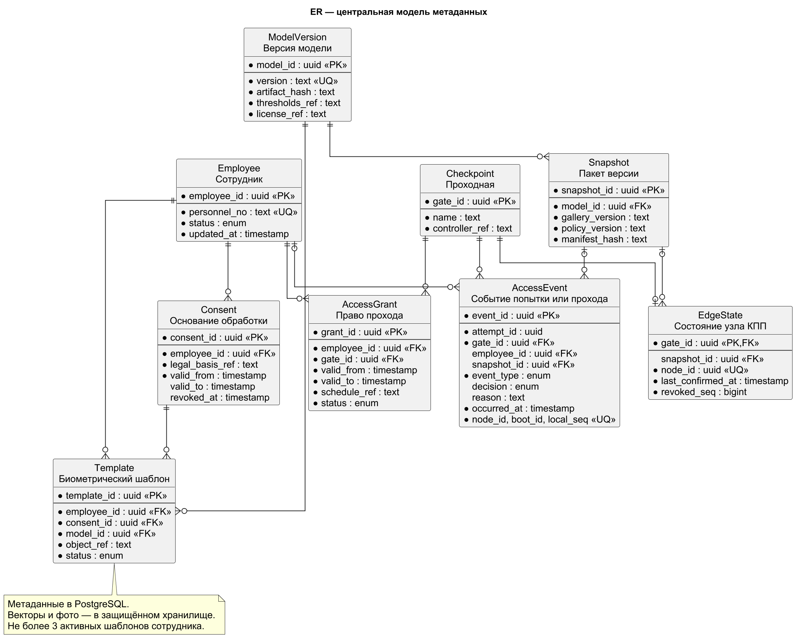
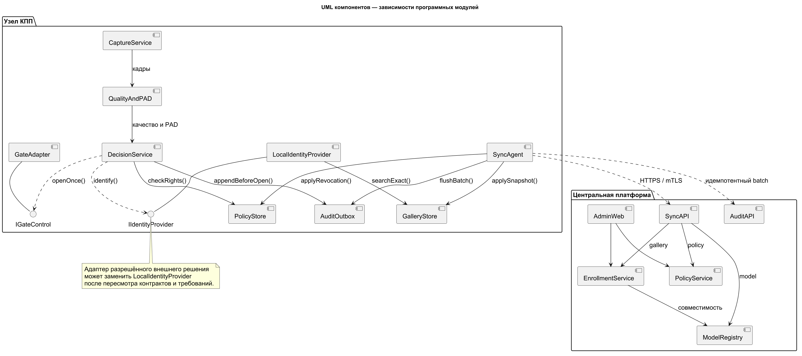
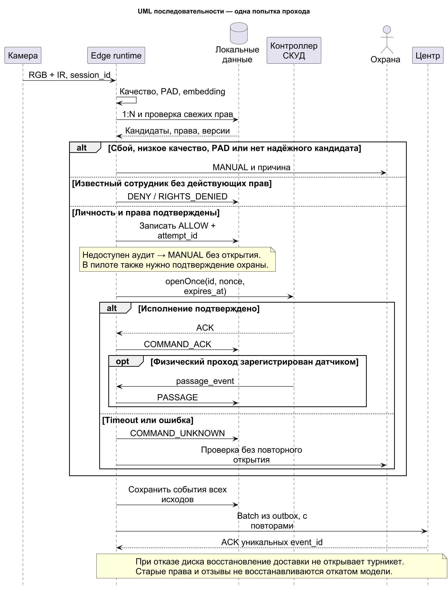

# Кейс №2 Идентификация сотрудников по лицу на проходных предприятия

**Состав команды:** Недиков Михаил Олегович, единственный автор.  
**Роли автора:** Product Owner, Data Engineer, Data Scientist, Software Architect, Data Architect.  
**Дизайн ML-системы:** «Контур доступа», MVP 1 и целевая production-система.  
**Версия документа:** 1.0 от 25.09.2026. **Форма работы:** проектная документация.

Система предназначена для проверки личности сотрудников промышленного предприятия на 10 проходных по базе примерно из 5000 человек. Она связывает распознавание лица, проверку признаков живого присутствия, действующие права доступа и регистрацию прохода. Цель — сократить ручные проверки и очереди, сохранив возможность пройти по пропуску через охранника. Распознавание человека само по себе не означает разрешение входа.

Масштаб предприятия и исходный процесс взяты из кейса. Все остальные численные значения ниже являются **проектными допущениями и критериями будущих испытаний**. EDA, обучение, измерение точности и пилот ещё не проводились. Работа включает проект внедрения, а не утверждение о готовности системы к промышленной эксплуатации.

**Навигация:** [цели](#1-цели-и-предпосылки) · [методология](#2-методология) · [пилот](#3-подготовка-пилота) · [внедрение](#4-внедрение-в-production) · [источники](#5-источники) · [диаграммы](diagrams/README.md) · [защита](DEFENSE.md).

## 1 Цели и предпосылки

### 1.1 Зачем разрабатывается продукт

Сейчас охранник сканирует пластиковый пропуск и визуально сравнивает сотрудника с фотографией в профиле. Существующая СКУД уже считывает идентификатор; ручным является сопоставление лица с фотографией. В часы начала смены это создаёт задержки, а качество проверки зависит от внимания охранника, освещения и давности снимка.

ML переводит сравнение изображений в воспроизводимую процедуру: вычисляет представление лица, ищет наиболее похожего сотрудника и отказывается от решения при недостаточной уверенности. Проверка живого присутствия уменьшает риск предъявления фотографии или экрана. Правила доступа остаются явными и независимыми от ML. Охранник рассматривает спорные случаи и обслуживает альтернативный проход.

Бизнес-цель итерации — проверить, возможно ли уменьшить медианное время обслуживания на 30% относительно измеренного AS-IS без ухудшения контроля допуска. Успех не измеряется сокращением штата: наблюдение за проходной и разбор исключений остаются необходимыми.

| Роль автора | Ответственность и результат |
| --- | --- |
| Product Owner | Бизнес-требования, границы MVP, критерии пилота |
| Data Engineer | Источники, качество данных, синхронизация и жизненный цикл |
| Data Scientist | Baseline, выбор модели, протокол оценки, пороги |
| Software Architect | Компоненты, интерфейсы, отказоустойчивость |
| Data Architect | ER-модель, разделение хранилищ, целостность и доступ |

### 1.2 Бизнес-требования и ограничения

| ID | Требование | Проверка при приёмке |
| --- | --- | --- |
| БТ-01 | Уменьшить время обслуживания сотрудника | Медиана не выше 70% AS-IS на сопоставимых сменах |
| БТ-02 | Не допускать вход по чужой или отозванной учётной записи | Отдельные проверки неизвестных лиц, отзыва прав и атак |
| БТ-03 | Сохранить проход без биометрии | Пропуск и проверка охранником доступны весь рабочий период |
| БТ-04 | Обслуживать 5000 сотрудников на 10 КПП | Нагрузочное испытание полной галереи и всех узлов |
| БТ-05 | Объяснять каждое решение | Причина, версии модели и правил, результат СКУД в журнале |
| БТ-06 | Управлять биометрией и отзывом согласия | Блокировка обработки, подтверждения удаления с узлов |

Функциональные требования:

- **ФТ-01:** регистрировать сотрудника после подтверждения личности и основания обработки; получать 3 качественных эталонных изображения в разные моменты.
- **ФТ-02:** проверять наличие ровно одного лица, качество кадра и живое присутствие, выполнять поиск 1:N с возможностью ответа «не найден».
- **ФТ-03:** проверять активность сотрудника, разрешение конкретного КПП, расписание, срок действия прав и свежесть локальной политики.
- **ФТ-04:** выдавать одно из решений ALLOW, DENY, MANUAL; после ALLOW отдельно получать подтверждение исполнения от контроллера.
- **ФТ-05:** регистрировать попытку, фактический проход и ручное решение раздельно; повтор команды не должен повторно открывать турникет.
- **ФТ-06:** доставлять на КПП совместимые версии модели, галереи и правил; отзывать права и удалять шаблоны.
- **ФТ-07:** показывать охраннику причину исключения; администратору — здоровье узлов; аналитику — агрегированные показатели.

Нефункциональные требования **НФТ-01–НФТ-06**: p95 решения до 1 с; p95 обслуживания до 3 с без ожидания в очереди; 2 попытки/с на КПП в нагрузочном тесте; месячная доступность автоматического пути на каждом КПП 99,5%; шифрование и разграничение доступа; воспроизводимость решения по версиям и журналу. Точки измерения приведены в разделе 4.3.

Ограничения: территория одной организации, штатные сотрудники, контролируемая зона съёмки, отсутствие массового видеонаблюдения. Гости, распознавание в толпе и дисциплинарные выводы по лицу не входят в MVP. Покрытие лица обязательными СИЗ не устраняется ради удобства модели: используется альтернативный проход.

**Правовая граница проекта.** Локальный поиск 1:N ниже — техническая учебная модель. Для внедрения в РФ одного согласия недостаточно: режим автоматической биометрической идентификации на КПП необходимо проверить по 152-ФЗ и 572-ФЗ. Статья 13 последнего регулирует проход на территории организаций, а статья 15 ограничивает обработку вне ЕБС. Поэтому автоматическое открытие на реальном объекте допускается только после определения применимого правового режима. Если требуется ЕБС, локальный идентификатор заменяется адаптером разрешённого решения, а хранение и показатели пересматриваются. Теневой пилот также требует законного основания обработки. [152-ФЗ, ст. 11](https://www.consultant.ru/document/cons_doc_LAW_61801/7336c78762a98b5f4f698b8c3800dca1111acc16/), [572-ФЗ, ст. 13](https://www.consultant.ru/document/cons_doc_LAW_436110/2515e702fc69ef591c95397631659d4a631bd844/), [ст. 15](https://www.consultant.ru/document/cons_doc_LAW_436110/b599780118c89e6e1fba4fb8a98aa3e77fb72fcc/).

Пилот проходит на двух КПП: сначала измерение AS-IS, затем теневое вычисление без команд турникету, затем ограниченный режим с подтверждением охранника. К самостоятельному открытию переходят только после выполнения технических, правовых и организационных критериев. Ошибка идентификации не является автоматическим основанием для санкций в отношении сотрудника.

### 1.3 Границы MVP и технический долг

В MVP входят БТ-01–БТ-06 в масштабе двух КПП, регистрация сотрудников, лицензированный экстрактор признаков, точный поиск по галерее, PAD, правила допуска, ручной маршрут, версии и аудит. До пилота обязательны отзыв прав, защита биометрии, тест неизвестных лиц, защита команд от повторения и подтверждение законности обработки.

В технический долг вынесены автоматизированное развёртывание сразу на 10 КПП, расширенные панели аналитики, обучение своей модели при подтверждённой потребности, адаптация к новым камерам, автоматизация расследования деградации. Эти пункты не включают критические меры безопасности. Поддержка гостей и нескольких предприятий — отдельные будущие итерации.

Результатом разработки MVP должны стать контейнерные сборки с фиксированными зависимостями, конфигурации порогов, подписанные манифесты моделей и набор проверок. Для воспроизводимости фиксируются хеши весов, seed эксперимента, версия датасета, список разбиения по людям и сессиям, preprocessing, пороги и оборудование. В данной работе эти артефакты **спроектированы**, но приложение и веса не создаются.

### 1.4 Предпосылки и процессы

| Параметр | Значение и статус |
| --- | --- |
| Сотрудники и КПП | Около 5000 и 10, факты кейса |
| Поток | 2 прохода на сотрудника в сутки, допущение: 10 000 попыток без повторов |
| Час пик | 3500 приходов за 30 минут, допущение для расчёта |
| Галерея | До 3 шаблонов на сотрудника, 15 000 векторов по 512 float32 |
| Съёмка | Один человек перед RGB+IR/глубинной камерой, проверяется на обследовании |
| Актуальность прав | Подтверждённая версия не старше 60 с, проектный предел |
| Период пилота | 8 недель работ, календарный план зависит от готовности данных |

**AS-IS:** предъявить пропуск → получить профиль и права → охранник визуально сравнивает лицо → разрешить или отказать → зарегистрировать проход. Проблемы: ручное сравнение каждой попытки, неодинаковая скорость, ограниченная измеримость ошибок.

[Описание AS-IS и правила чтения IDEF0](diagrams/README.md#1-процесс-as-is).

**TO-BE:** получить допустимый кадр и проверить PAD → идентифицировать сотрудника → проверить права и принять решение → исполнить команду и зафиксировать факт. При низком качестве, неоднозначном совпадении или техническом сбое сотрудник направляется к охраннику. При явном запрете доступа система выдаёт DENY; охранник может лишь инициировать предусмотренную процедуру проверки, а не отменить запрет одной кнопкой.

[Описание TO-BE и изменения процесса](diagrams/README.md#2-процесс-to-be).

## 2 Методология

### 2.1 Постановка ML-задачи

Задача — **идентификация открытого множества 1:N**: для изображения определить сотрудника среди зарегистрированных либо вернуть неизвестное лицо. Это отличается от верификации 1:1, когда предъявленный пропуск заранее задаёт одну личность. Второй независимый ML-блок — PAD, то есть обнаружение предъявления фотографии, экрана или другой подделки.

Предлагается предварительно обученный экстрактор представлений семейства ArcFace и L2-нормированные 512-мерные векторы. ArcFace задаёт способ обучения различимых представлений лиц; конкретные веса и их пригодность выбираются экспериментально. [Исходная статья ArcFace](https://openaccess.thecvf.com/content_CVPR_2019/html/Deng_ArcFace_Additive_Angular_Margin_Loss_for_Deep_Face_Recognition_CVPR_2019_paper.html).

Для запроса q и шаблонов сотрудника e вычисляется `score(e) = max(q · t)` по его активным шаблонам. Кандидаты ранжируются **по сотрудникам**, поэтому три шаблона одного человека не занимают три места в top-2. Кандидат принимается, если `score1 >= tau` и `score1 - score2 >= delta`. Иначе результат — MANUAL. Порог tau и отступ delta выбираются на валидации; численное значение без данных не назначается. Сходство не трактуется как вероятность.

Точный перебор 15 000 векторов выбран вместо приближённого поиска: объём мал, а исключение случайного пропуска кандидата упрощает оценку безопасности. Замена версии экстрактора требует пересчёта всей галереи; смешивать векторы разных моделей нельзя. Автоматическое дообучение на результатах самой модели запрещено из-за риска накопления ложных меток.

### 2.2 Блок-схемы baseline и MVP

**Бизнес-baseline** — действующий пропуск и визуальная проверка. **ML-baseline** — один эталон на сотрудника, фиксированный экстрактор, точный поиск 1:N и один порог. Он измеряется только офлайн/в тени и не управляет турникетом: без PAD и правил допуска оценка сходства недостаточна для реального входа.

MVP использует до трёх эталонов, контроль качества, PAD, отступ между top-1 и top-2, действующие права и журнал с подтверждением СКУД. Обе системы сравниваются на одном замороженном тесте, включая неизвестных людей и сложные условия. Дополнительные блоки принимаются только при измеримой пользе.

### 2.3 Этапы решения задачи

#### Этап 1 Подготовка данных и EDA

Нельзя решить задачу без эталонов с подтверждённой личностью, независимых контрольных съёмок, актуальных прав доступа и разрешённого основания обработки. Для оценки отказа необходимы лица, отсутствующие в галерее; для оценки PAD — контролируемые предъявления атак. Данные сотрудников не выгружаются в публичные сервисы или GitHub.

| Данные для целевых переменных | Источник и наличие | Ресурс получения | Качество |
| --- | --- | --- | --- |
| employee_id или UNKNOWN | Кадровый реестр; доступ не предоставлен | Кадровик и DE, проверка документов | Не проверено |
| bona_fide / attack и тип атаки | Контролируемые испытания; нужно собрать | DS и служба безопасности | Не проверено |
| Правомерный ALLOW / DENY | Права СКУД и независимый разбор | Владелец СКУД и охрана | Не проверено |
| Время обслуживания и факт прохода | Журнал КПП; выгрузка не предоставлена | DE и руководитель охраны | Не проверено |

| Признаки и служебные данные | Источник и наличие | Ресурс получения | Качество |
| --- | --- | --- | --- |
| Эталонные фото, метки сессий | Профили из кейса; пригодность неизвестна | Оператор регистрации, DE | Нужна повторная съёмка |
| Независимые RGB и IR/глубина | Камеры пилотных КПП; требуется обследование | Инженер СКУД, DS | Не проверено |
| Поза, резкость, засветка, число лиц | Вычисляются из кадров | DS | Пороги после EDA |
| КПП, время, версия камеры | Метаданные съёмки | DE | Проверить часы и полноту |
| Согласия, статусы, интервалы прав | Кадровая система и СКУД | Ответственный за ПДн, DE | Проверить актуальность |

План EDA: проверить дубли и ошибочные employee_id; распределения качества по КПП и сменам; долю закрытых лиц, очков и касок; давность эталонов; долю повторных кадров из одного видео; согласованность времени; доступность IR. Дубликаты удаляются до разбиения. ФИО, должность и номер пропуска не используются как признаки распознавания лица. При слабом качестве источника результат этапа — план повторной регистрации, а не неподтверждённая метрика.

Выход этапа: паспорт источников, протокол оснований обработки, версия набора, перечень дефектов, согласованный план сбора и manifest разбиений. Переход к экспериментам возможен после подтверждения меток и отсутствия пересечений кадров.

#### Этап 2 Разбиение и ML-baseline

Предобученный экстрактор в первой итерации заморожен: локальная выборка не используется для обучения его весов. План калибровки — 1000 сотрудников, итогового теста — 4000 других сотрудников. Для каждого контрольного человека регистрационная сессия отделена по времени от запросов. В каждом эксперименте галерея включает всех 5000 разрешённых сотрудников, чтобы нагрузка ложных совпадений соответствовала deployment; изображения запросов в галерею не попадают. Присутствие регистрационных шаблонов тестовых людей необходимо для задачи enrolled identification и не означает обучение на тестовых запросах.

Запросы UNKNOWN собираются у отдельных добровольцев, отсутствующих в галерее; люди калибровочной и тестовой UNKNOWN-групп не пересекаются. Числа — план, а не наличие данных. Если состав не собран, испытание признаётся недостаточным. Один видеоролик не разбивается на train и test, соседние кадры не считаются независимыми наблюдениями.

Baseline использует один эталон и tau, выбранный по валидации. На выходе — таблица FPIR/FNIR при рабочем пороге, задержки и разбор ошибок. Для будущего дообучения создаётся отдельная training-группа людей, не пересекающаяся с validation/test; повторное использование итогового теста для настройки требует новой закрытой выборки.

#### Этап 3 Основной MVP и интерпретация

Сначала тестируются контроль качества и три эталона, затем PAD, затем delta. Для каждого изменения проводится ablation: сравнение с предыдущим вариантом при одинаковом ограничении FPIR. Распознавание обрабатывает нормированное лицо, PAD — оригинальные кадры и доступные IR/глубинные признаки, чтобы preprocessing распознавания не удалял признаки подделки.

Порог PAD настраивается по раздельным типам атак; усреднение по всем атакам может скрыть слабую защиту от конкретного носителя. План испытаний включает печатное фото, фото на экране, видеоповтор и доступные маски. PAD не решает проблему прохода вслед за другим человеком: нужны датчики турникета и охрана. Подмена цифрового потока камеры проверяется отдельно как атака на интерфейс, а не только как presentation attack. [NIST о PAD](https://www.nist.gov/publications/face-analysis-technology-evaluation-fate-part-10-performance-passive-software-based).

Охранник получает код причины: LOW_QUALITY, PAD_FAILED, NO_MATCH, AMBIGUOUS, RIGHTS_DENIED, STALE_POLICY, DEVICE_ERROR. Ему не показывается фиктивный «процент уверенности». Эффект каждого блока проверяют DS и владелец процесса: сокращение ручных проверок допустимо только при выполнении ограничений ложного допуска.

#### Этап 4 Метрики и критерии качества

Для 1:N основными являются FPIR и FNIR, а не accuracy на закрытом наборе из известных сотрудников. FPIR измеряется на поиске по всей галерее. Парный FMR из задачи 1:1 нельзя подставлять вместо него. Определения и зависимость от размера галереи отражены в [NIST FRTE 1:N](https://pages.nist.gov/frvt/html/frvt1N.html).

| Метрика | Определение и цель | Связь с бизнесом |
| --- | --- | --- |
| FPIR | Доля UNKNOWN-запросов с принятым кандидатом; верхняя односторонняя 95% граница ≤ 0,001 | Риск принять незарегистрированного человека |
| FNIR rank-1 | Доля запросов известных лиц, где истинная личность не принята на первом месте; ≤ 2% | Повторные попытки и ручные проверки |
| Wrong-ID | Доля известных запросов с принятием другого сотрудника; верхняя 95% граница ≤ 0,001 | Чужие права могут быть опаснее отказа |
| APCER | Пропущенные PAD атаки / все атаки данного типа; верхняя 95% граница ≤ 1% для каждого испытанного типа | Устойчивость к фото и видеоповтору |
| BPCER | Ошибочные PAD-отказы / bona fide предъявления; ≤ 3% | Дополнительная очередь |
| Доля MANUAL | MANUAL / попытки согласившихся сотрудников, включая сбои и плохие кадры; ≤ 5% | Нагрузка охраны |
| Время обслуживания | От начала взаимодействия до открытия или направления к охране; медиана ≤ 70% AS-IS, p95 ≤ 3 с | Скорость прохода |

Качество распознавания публикуется на технически пригодных запросах вместе с долей отбраковки. Сквозные показатели учитывают **все** попытки: плохие кадры нельзя исключить, чтобы искусственно улучшить результат. FNIR включает неверную личность; Wrong-ID выделяет опасную часть ошибок. FPIR, PAD и проверка прав оцениваются отдельно и в составе системы: их вероятности нельзя просто перемножить без доказательства независимости.

Чтобы ноль ошибок давал одностороннюю верхнюю 95% границу 0,001, требуется не менее 2995 независимых испытаний: `1 - 0.05^(1/n) <= 0.001`. Для границы 1% — 299. Это нижняя оценка при нуле ошибок и независимости, а не гарантия достаточности сбора. Повторы одного человека коррелированы; поэтому дополнительно строятся интервалы кластерным bootstrap по людям и сессиям, сохраняется описание состава выборки. Для ненулевых ошибок применяются точные биномиальные интервалы и анализ кластеризации. Нельзя заявлять подтверждённый FPIR по миллионам зависимых пар из десятка фотографий.

При 10 000 попытках в сутки порог FPIR 0,001 **не означает** «не более 10 реальных нарушителей в день»: FPIR относится к UNKNOWN-предъявлениям и не измеряет поток атак. Значение служит учебным входным критерием пилота; допустимый остаточный риск для конкретного предприятия определяет служба безопасности. Для объекта с высокими последствиями требуется второй фактор и более строгий протокол.

#### Этап 5 Инференс и жизненный цикл модели

Единица инференса — одна попытка прохода, связанная с session_id; допускается одна повторная съёмка, затем ручной маршрут. Идентификация запускается по событию, прогнозного горизонта нет. Галерея обновляется при регистрации или отзыве, права — по событиям с проверкой версии каждые 15 с. Политика считается просроченной через 60 с после последнего подтверждения.

Кандидатные модели пересматриваются по результатам ежемесячного анализа и при устойчивой деградации, без обязательного ежемесячного обучения. Новая версия проходит закрытый тест, теневой запуск, один пилотный КПП и поэтапное развёртывание. Модель, галерея и пороги поставляются одним совместимым пакетом; переключение атомарное. При росте ошибок — откат пакета, при этом отозванные права и список удалений **не откатываются**.

## 3 Подготовка пилота

### 3.1 Способ оценки

Проектный пилот включает 500 добровольно участвующих сотрудников на двух КПП, полный нагрузочный тест галереи 5000 человек и отдельный расширенный набор для статистической оценки ошибок. Небольшой операционный пилот не заменяет закрытое испытание редких ложных совпадений.

Недели 1–2: обследование, правовая проверка, сбор эталонов и измерение AS-IS. Недели 3–4: EDA, baseline, калибровка, закрытый тест и отладка СКУД. Недели 5–6: теневой режим на двух КПП. Недели 7–8: режим с подтверждением охранника, а при прохождении всех ворот — ограниченное автоматическое открытие. При невыполнении условий этап продлевается, календарная дата не заменяет приёмку.

Для бизнес-метрик используются сопоставимые блоки «КПП × смена × день недели». Порядок экспериментального и обычного режима чередуется; фиксируются число проходящих, доля СИЗ, освещение и длина очереди. До сравнения задаются основные метрики и правила исключений. Интервалы различий рассчитываются по блокам смен, а не по отдельным коррелированным кадрам. Служба безопасности независимо разбирает все ложные допуски и выборку обычных проходов. Небезопасные предъявления выполняются на испытательном стенде, без возможности физического входа.

### 3.2 Критерии успешности и остановки

| Условие | Решение |
| --- | --- |
| Выполнены ограничения ML из 2.3 и достаточно данных для интервалов | Допустить следующий технический этап |
| Медиана обслуживания снижена ≥ 30%, p95 ≤ 3 с, очередь p95 не выросла | Бизнес-эффект подтверждён в условиях пилота |
| MANUAL ≤ 5%; доступен альтернативный проход | Нагрузка охраны приемлема |
| Нет несанкционированных открытий, выполнены отзыв прав и тесты отказов | Пройден критерий операционной безопасности |
| Подтверждены правовой режим, лицензии, регламенты и обучение охраны | Возможен переход к production-планированию |

Событие несанкционированного открытия, утечка, неподтверждённый отзыв прав или обход PAD немедленно останавливает автоматическое открытие. Проблемный узел переходит на обычный проход; выполняются расследование, исправление и повторная проверка. Если данных недостаточно для доверительной границы, итог — «критерий не подтверждён», а не «система точна».

Итог пилота: подписанный протокол с числителями и знаменателями метрик, интервалами, версиями, составом групп и ограничениями; решение GO, REWORK или STOP. Нулевое число инцидентов в коротком пилоте не доказывает нулевого риска.

### 3.3 Вычислительная подготовка

Планируемый узел КПП: 4–8 CPU-ядер, 16 ГБ RAM, защищённое хранилище и ускоритель только по результатам теста. Не заявляется, что любой CPU обеспечит целевую задержку. Профилируются отдельно детекция, PAD, embedding, поиск, правила и подтверждение команды; проверяются холодный старт, перегрев и заполнение журнала.

Галерея занимает `5000 × 3 × 512 × 4 = 30 720 000 байт`, около 29,3 MiB без метаданных. Поиск — 7,68 млн произведений компонент на запрос, около 15,36 млн на 2 запроса/с. Это расчёт поиска, не всей нейросетевой обработки. Лимит одной активной камеры на полосу, ограниченная очередь из двух ожидающих попыток и deadline 2 с защищают узел от накопления запросов. При превышении — MANUAL без позднего открытия.

Из 3500 приходов за 1800 с получается 1,94 попытки/с по предприятию и 0,194 на КПП при равномерном распределении. При трёхкратной неравномерности — 0,583/с на загруженном КПП. Тестовый запас 2/с относится к вычислительной подсистеме. Физическая пропускная способность полос измеряется отдельно: цикл 3 с даёт лишь 0,333 человека/с, следовательно, в таком пике потребуются минимум две полосы на загруженном КПП либо изменение распределения потока. Число полос обследуется до закупки.

## 4 Внедрение в production

### 4.1 Архитектура решения и структура данных

На каждом КПП размещается edge-узел: получение кадров, PAD, embedding, точный поиск, правила и адаптер контроллера. Центральный контур управляет регистрацией, правами, моделями и аудитом. Кадры штатных проходов не пересылаются в центр; передаются события и версии. Вариант с ЕБС использует отдельный IdentityProvider и требует нового согласованного маршрута обработки; его задержки не приравниваются к локальному варианту.

PostgreSQL хранит сотрудников, основания обработки, права, метаданные шаблонов, версии и события. Зашифрованное объектное хранилище содержит только разрешённые эталоны и артефакты моделей. Edge хранит шифрованную локальную галерею и outbox событий. Эти копии физически распределены по десяти КПП: нужны низкая задержка, ограничение передачи биометрии и устойчивость к кратким сетевым сбоям. Это распределённое хранение прикладных данных, а не обязательный шардированный кластер PostgreSQL.

В ER-модели Employee имеет несколько Consent, Template и AccessGrant. Grant связывает сотрудника с КПП и интервалом действия. Template связан с ModelVersion и основанием Consent. Event может не иметь employee_id у неизвестного лица, но всегда связан с КПП; событие сохраняет причины и версии решений. Decision является частью Event, а Passage подтверждается отдельным событием датчика/контроллера. Snapshot задаёт согласованный пакет галереи и политики; EdgeState фиксирует подтверждённую версию каждого КПП.

Таблица [словаря данных и ограничений](diagrams/README.md#3-модель-данных) дополняет диаграмму. Внешний ключ не заменяет проверку срока согласия или права. Для центрального журнала используется уникальный event_id; для edge — монотонный local_seq в пределах node_id и boot_id. Таблицы аудита партиционируются по месяцу только после подтверждения объёма.

### 4.2 Инфраструктура и масштабируемость

| Вариант | Преимущество | Недостаток и решение |
| --- | --- | --- |
| Все вычисления в центре | Меньше узлов моделей | Передача кадров и зависимость прохода от сети |
| Edge и центральное управление | Локальная обработка, ограниченный поток данных | Требуются версии, удаление копий и контроль узлов; выбран как учебная архитектура |
| Внешний поставщик / ЕБС | Возможность выполнить обязательный режим обработки | Иные условия интеграции, стоимость и задержки; отдельное решение после правовой проверки |

Для MVP достаточно двух edge-узлов, серверных виртуальных машин центрального приложения и PostgreSQL, внутреннего объектного хранилища и мониторинга. В production проектируются две реплики API за балансировщиком, PostgreSQL primary и standby с контролируемым переключением и резервное объектное хранилище. Kubernetes и Kafka не обязательны для 10 КПП: доставка событий через HTTPS batch и локальный outbox проще в эксплуатации.

Событие сначала записывается локально на устойчивый носитель, затем отправляется с повтором и jitter. Центр подтверждает принятые event_id; повторная доставка идемпотентна. Разделение БД и отправки синхронизации выполняется через транзакционный outbox. Порядок кадров не определяется временем приёма в центре, используются локальная последовательность и синхронизированные часы.

При потере связи автоматический режим разрешён лишь пока последняя подтверждённая политика моложе 60 с. После этого узел переходит в MANUAL, даже если локальная галерея доступна. Если отказал накопитель и нельзя записать аудит, автоматическое открытие также отключается. «Работа без сети» не означает бессрочное использование устаревших прав.

Отзыв прав имеет приоритет: доставка события и подтверждение узлов, а узел без подтверждения свежести блокирует автоматический путь. Плановый срок удаления шаблона с работающих узлов — до 15 минут после принятия запроса; фактический правовой срок определяется основанием и регламентом. Отключённый узел до синхронизации не включается в автоматический режим. При восстановлении резервной копии сначала применяются реестр отзывов и удаления, затем разрешается поиск.

### 4.3 Требования к работе системы

| Показатель | Проектная цель | Точка измерения |
| --- | --- | --- |
| Decision latency | p95 ≤ 1 с, p99 ≤ 2 с | От окончания захвата кадров до ALLOW/DENY/MANUAL |
| Обслуживание | p95 ≤ 3 с | От начала взаимодействия до открытия/направления к охране |
| Throughput | 2 попытки/с на КПП, 20/с на 10 КПП | Нагрузочный генератор, полная галерея |
| Автоматическая доступность | ≥ 99,5% времени штатного режима каждого КПП в месяц | Heartbeat и синтетическая проверка без физического открытия |
| Центральный API | 99,9% успешных валидных запросов, p95 ≤ 300 мс | Вход балансировщика, без тяжёлых загрузок |
| Свежесть прав | ≤ 60 с | Возраст последнего подтверждения версии на edge |
| RPO / RTO центра | ≤ 15 мин / ≤ 60 мин | Проверка восстановления БД и реестра отзывов |
| Доставка событий | p95 ≤ 10 с при рабочей сети | Локальная запись → центральное подтверждение |

Это SLO — проектные целевые уровни, а не заключённое SLA. SLA согласуется после пилота вместе с часами обслуживания, ответственностью и исключениями. Отсутствие биометрического сервиса считается его недоступностью, даже если охрана продолжает пропускать людей. На 30 суток 99,5% допускает до 216 минут недоступности; 99,9% по запросам нельзя автоматически переводить в минуты.

Для 10 000 событий/сутки по 2 КБ получается около 20 МБ/сутки и 7,3 ГБ/год исходного журнала. С индексами и накладными расходами ×3 — около 22 ГБ/год, без резервных копий. Локальный резерв на 7 суток при средней нагрузке одного КПП — 14 МБ, но выделяется 1 ГБ с порогом заполнения 80%. При аварийном запасе 2 события/с 1 ГБ хватит примерно на 2,9 суток; предупреждение должно сработать раньше. Это не срок хранения кадров: изображения штатных проходов не журналируются.

### 4.4 Безопасность системы

Камеры и контроллеры находятся в отдельном сетевом сегменте. Узлы и центральный API аутентифицируются взаимно, с ротацией сертификатов. Команда открытия содержит attempt_id, КПП, короткий срок действия и одноразовый nonce; контроллер проверяет источник и отклоняет повтор. ALLOW после истечения deadline не исполняется. Решение, команда, подтверждение контроллера и сигнал физического прохода — разные события.

Пакет модели и галереи подписывается, проверяются хеши и совместимость. Обновления разворачиваются на одном КПП, затем расширяются. Правила доступа и реестр отзывов сохраняют актуальную версию при rollback ML. Администратор моделей не выдаёт права прохода; оператор регистрации не может стереть журнал; охранник не видит массовую выгрузку шаблонов. Привилегированные действия требуют MFA и аудита.

Проверки до запуска: повтор команд, подмена камеры, смена employee_id в сообщении, два лица в кадре, просроченная политика, отказ диска, перегрев и отключение сети. Аварийная эвакуация управляется независимыми средствами пожарной безопасности: ML не блокирует выход и не заменяет сертифицированные аварийные цепи.

### 4.5 Безопасность данных

Изображения и шаблоны, применяемые для установления личности, рассматриваются как биометрические данные. Вектор не является анонимным только потому, что непохож на фотографию. Для предполагаемой обработки по согласию требуется письменная форма с учётом исключений закона; сохраняется альтернативный проход. Это следует из [статьи 11 152-ФЗ](https://www.consultant.ru/document/cons_doc_LAW_61801/7336c78762a98b5f4f698b8c3800dca1111acc16/).

Проектные правила минимизации: кадры обычного прохода остаются в RAM не более 5 с после решения; до трёх эталонов хранятся только при подтверждённом основании и необходимости; шаблоны действуют не дольше основания; события без изображения — до 365 дней; резервные копии — до 30 дней. Эти сроки являются предложением для локальной учебной модели и не заменяют обязательные требования режима ЕБС или конкретной организации.

Данные шифруются при передаче и хранении, ключи отделены от копий БД. Запрещены биометрия в логах, публичные бакеты, реальные ФИО сотрудников в примерах API и перенос датасета в репозиторий. Удаление охватывает центральное хранилище, галереи edge, кэши и регламент резервных копий. Для резервных копий обеспечиваются изоляция от обычного использования, истечение срока и повторное применение удалений после восстановления; криптографическое уничтожение требует соответствующего управления ключами и не подменяется удалением строки БД.

Поскольку юрисдикция предприятия в кейсе не задана, для российского внедрения оставлен обязательный этап анализа 572-ФЗ. Наличие охранника в пилоте само по себе не позволяет объявить автоматизированный ML-поиск исключением из закона. Применимость GDPR оценивается по фактической территории и субъектам; утверждение о соответствии всем законам без обследования не делается.

### 4.6 Издержки

Ниже — **расчётный сценарий**, а не рыночные цены, коммерческое предложение или утверждённая смета. Для сопоставимости принят срок амортизации 36 месяцев. Оплата труда охраны и существующие турникеты в расчёт не включены; экономия штата не предполагается.

| Статья | Условный расчёт | Сумма |
| --- | --- | --- |
| Камеры с IR/глубиной | 10 × 70 000 руб. | 700 000 руб. |
| Edge-узлы и защита | 10 × 90 000 руб. | 900 000 руб. |
| Центральный контур и резервирование | 1 комплект × 400 000 руб. | 400 000 руб. |
| Интеграция, монтаж, испытания | 1 этап × 500 000 руб. | 500 000 руб. |
| Итого разовые затраты | Без лицензии и расширения полос | 2 500 000 руб. |
| Амортизация | 2 500 000 / 36 | 69 444 руб./мес. |
| Сопровождение | 40 ч × 1500 руб. | 60 000 руб./мес. |
| Электропитание, копии, сеть | Условный резерв | 10 000 руб./мес. |
| Лицензирование и обязательная интеграция | L, определяется предложением поставщика | L руб./мес. |
| Итого ежемесячно | 69 444 + 60 000 + 10 000 + L | 139 444 + L руб. |

Стоимость дополнительных полос, ЕБС и правовой адаптации не скрыта в нулевой цене: до их оценки бюджет является неполным. Код InsightFace и доступные предобученные веса имеют разные условия; публичные веса заявлены для некоммерческого исследования, поэтому промышленное использование требует отдельной проверки лицензии. [Лицензионная политика InsightFace](https://github.com/deepinsight/insightface/blob/master/README.md).

Экономический результат рассчитывается после пилота: `число проходов × сокращение времени / 3600 × стоимость часа + снижение подтверждённых потерь - ежемесячные затраты`. Время ожидания работников и труд охраны считаются раздельно, чтобы не удваивать выгоду. Если окупаемость или безопасность не подтверждаются, допустимо оставить обычную СКУД.

### 4.7 Точки интеграции

| Интерфейс | Данные и правило |
| --- | --- |
| POST /v1/enrollments | employee_id, основание, защищённая загрузка; только оператор регистрации |
| POST /v1/attempts | Локальный session_id и ссылка на буфер камеры; внешний upload кадров запрещён |
| GET /v1/snapshots/current | manifest: model, gallery, policy, revocations, подпись; условный запрос по версии |
| POST /v1/events/batch | Список event_id и local_seq; повтор не создаёт дубликат |
| POST /v1/revocations | Отзыв прав/шаблонов, подтверждения каждого узла, журнал |
| Адаптер СКУД | open(attempt_id, gate_id, nonce, expires_at), ACK и отдельный passage_event |
| Кадровая система | Создание, изменение статуса, увольнение; идемпотентный event_id |

Пример результата локального решения: `attempt_id=demo-001; decision=MANUAL; reason=NO_MATCH; employee_id=null; model_version=m1; policy_version=p17`. ALLOW требует доступной записи аудита, свежих прав и разрешённого режима работы. REST-контракты возвращают 400 для неверного запроса, 401/403 при отсутствии прав, 409 при конфликте версии, 503 при недоступности зависимости. Ошибка 503 не превращается в ALLOW. Открытие после неопределённого ACK не повторяется автоматически: состояние выясняется по attempt_id.

### 4.8 Риски и меры

| Риск | Последствие | Мера и владелец роли |
| --- | --- | --- |
| Неподходящий правовой режим | Невозможность внедрения локального поиска | Проверка до сбора, адаптер разрешённого решения; PO |
| Устаревшие фото и СИЗ | Рост FNIR и MANUAL | Перерегистрация, контролируемый свет, альтернативный проход; DS |
| Фото, экран, цифровая подмена | Чужой доступ | PAD по типам атак, защищённый канал камеры, испытания; архитектор |
| Неверные метки | Оптимистичная оценка качества | Проверка личности при регистрации, независимый аудит; DE |
| Утечка между выборками | Невоспроизводимый результат | Разбиение по людям и сессиям, замороженный тест; DS |
| Недостаток UNKNOWN и атак | Ложная уверенность в редкой ошибке | Интервалы и минимальная выборка; запрет GO без доказательств; DS |
| Потеря сети и устаревшие права | Проход уволенного сотрудника | TTL 60 с, MANUAL, приоритетный отзыв; архитектор |
| Утечка шаблонов | Длительный риск для работников | Минимизация, ключи, аудит, удаление копий; архитектор данных |
| Несовместимость модели и галереи | Массовые отказы | Подписанный пакет, атомарное переключение и откат; архитектор |
| Недостаток физических полос | Очереди при быстрой ML-модели | Замер потока, расчёт полос, нагрузочное испытание; PO |
| Неравномерное качество | Ошибки у отдельных групп и условий | Срезы по устройствам, сменам, СИЗ; добровольные демографические срезы только при законном основании; DS |

Проект завершается комплектом согласованных моделей, требований и протоколов будущей проверки. Решение о внедрении принимается по результатам пилота, а не по наличию архитектурной схемы. При отказе от локальной биометрии требования к журналу, правам, альтернативному проходу и измерению очередей остаются применимыми.

## 5 Источники

1. [Исходное проектное задание](sources/assignment.txt), предоставлено пользователем: кейс №2, 5000 сотрудников, 10 КПП, перечень обязательных моделей.
2. [Предоставленный шаблон MLSD](sources/mlsd-template.md), Reliable ML; [репозиторий автора шаблона](https://github.com/IrinaGoloshchapova/ml_system_design_doc_ru). Использована структура разделов, текст проекта разработан для выбранного кейса.
3. [Deng et al. ArcFace, CVPR 2019](https://openaccess.thecvf.com/content_CVPR_2019/html/Deng_ArcFace_Additive_Angular_Margin_Loss_for_Deep_Face_Recognition_CVPR_2019_paper.html): метод обучения представлений лица.
4. [NIST FRTE 1:N](https://pages.nist.gov/frvt/html/frvt1N.html): постановка идентификации и метрики FPIR/FNIR. Значения чужих бенчмарков не используются как результаты проекта.
5. [NIST FATE Part 10, PAD](https://www.nist.gov/publications/face-analysis-technology-evaluation-fate-part-10-performance-passive-software-based): отдельная оценка атак предъявления.
6. [InsightFace README](https://github.com/deepinsight/insightface/blob/master/README.md): различие лицензий кода и предобученных моделей.
7. [152-ФЗ, статья 11](https://www.consultant.ru/document/cons_doc_LAW_61801/7336c78762a98b5f4f698b8c3800dca1111acc16/): биометрические персональные данные.
8. [572-ФЗ, статья 13](https://www.consultant.ru/document/cons_doc_LAW_436110/2515e702fc69ef591c95397631659d4a631bd844/) и [статья 15](https://www.consultant.ru/document/cons_doc_LAW_436110/b599780118c89e6e1fba4fb8a98aa3e77fb72fcc/): правовые ограничения реального внедрения.

Дата обращения к внешним источникам: 25.09.2026. Численные цели, инфраструктурные параметры и смета являются проектными решениями автора и не приписываются указанным источникам.
